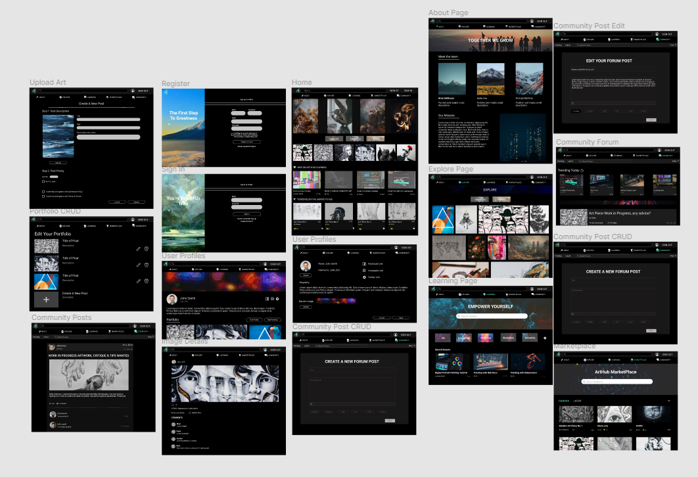
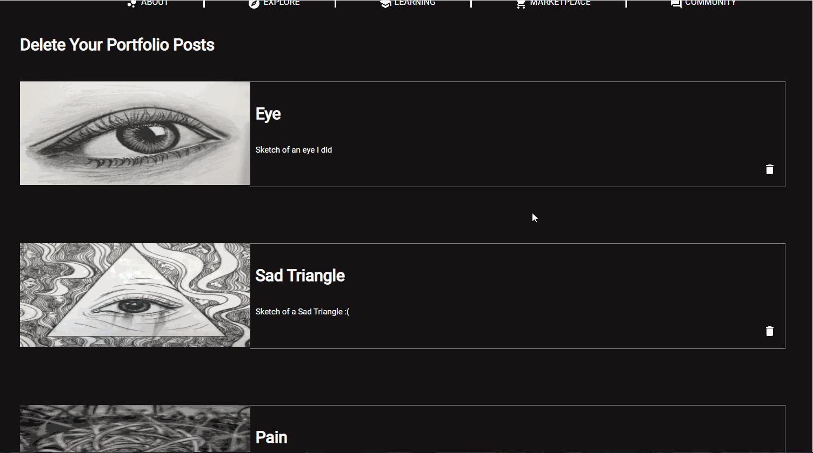
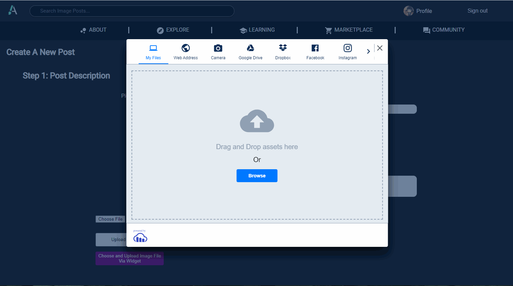
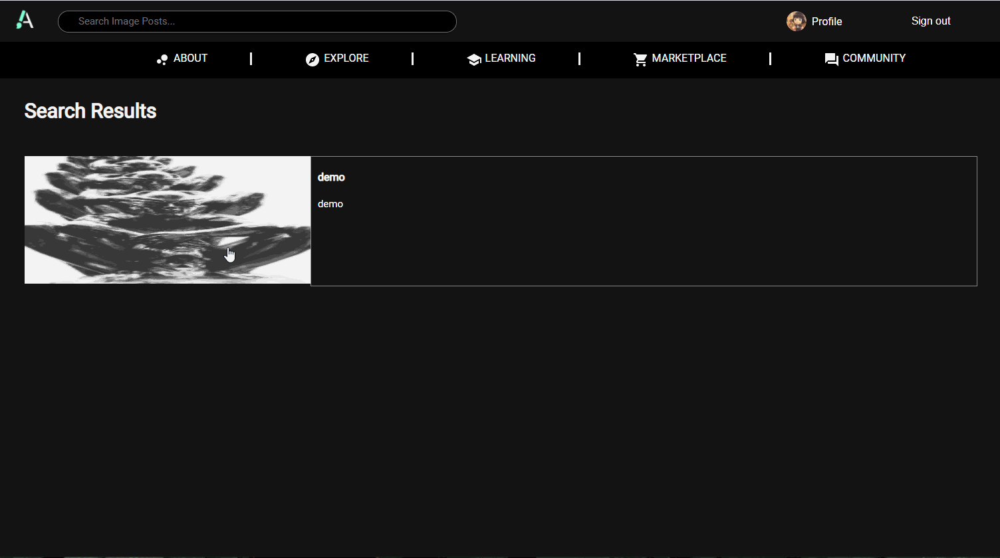
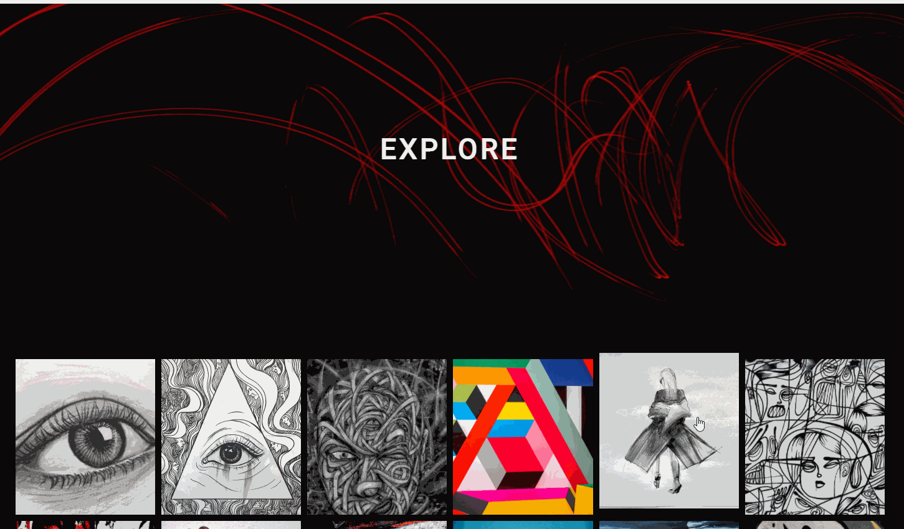
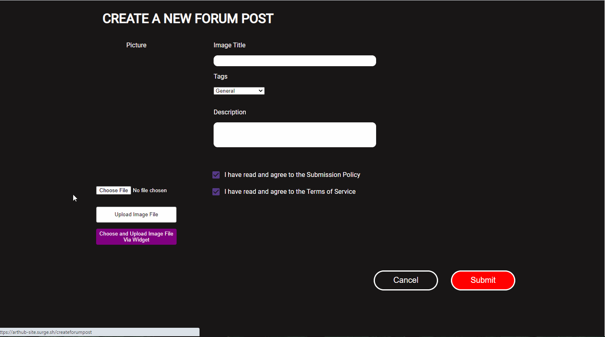

# SITE Capstone Project

SITE Course Year: **2021**

Cohort: **Course Hero**

Team Member Names: **Brian Balthazar, Stella Kim, Rodrigo Martinez**

Mentors Names: **Rachel Okun, Saurabh Sood, Ernesto Rodriguez**

## Project Overview

Our goal is to help beginner artists gain exposure by helping them securely share their work with fellow beginner artists while also building a sense of community.

Deployment Website: https://arthub-site.surge.sh/

## WireFrames

Wireframes on Figma: https://www.figma.com/file/6leFJTd88cHkmYfATtc9u0/ArtHub-Wireframes?node-id=0%3A1

## Walkthrough

- Showcasing Landing Page

- Showcasing Sign up, Sign in, Sign out features

- Showcasing User Profile, Edit Profile, Edit Portfolio posts

- Showcasing User creating an image post and uploading images

- Showcasing Search Bar System Feature

- Showcasing Liking and Commenting 

- Showcasing Learning Page

- Showcasing Community Forum Page
- 

